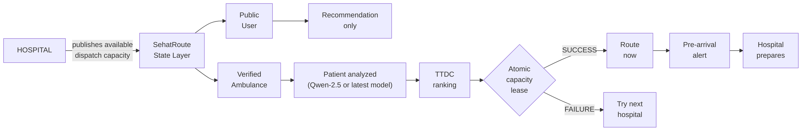
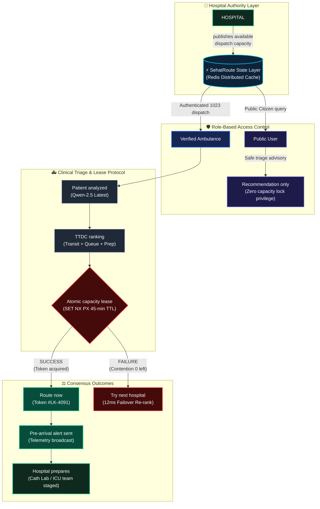

# SehatRoute AI — End-to-End System Flowchart

This document provides the formal **Mermaid Flowchart** and architectural specifications for the SehatRoute AI tri-party orchestration network.

---

## 1. Clean Horizontal Mermaid Flowchart (Standard Theme)

Used on Slide 7 of `SehatRoute_AI_Pitch_Deck.pptx` and `pitch-deck.html`:



---

## 2. Extended Flowchart (Dark Themed with Subgraphs)



---

## 2. ASCII Architecture Model

```text
                    HOSPITAL
                       │
              publishes available
             dispatch capacity
                       │
                       ▼
             SehatRoute State Layer
                       │
                ┌──────┴───────┐
                │              │
             Public         Verified
              User          Ambulance
                │              │
           Recommendation      │
           only                │
                               ▼
                       Patient analyzed
                               │
                               ▼
                         TTDC ranking
                               │
                               ▼
                    Atomic capacity lease
                               │
                        ┌──────┴──────┐
                        │             │
                     SUCCESS        FAILURE
                        │             │
                    Route now      Try next
                        │           hospital
                        ▼
                Pre-arrival alert
                        │
                        ▼
                  Hospital prepares
```

---

## 3. Architecture Specification

1. **Hospital Authority Layer:** Hospitals publish inbound capacity (ICU beds, Cath Lab, trauma bays) without internal IT friction via progressive web or SMS.
2. **Public User Separation:** Citizens receive clinical triage and recommended destinations, but **cannot lock capacity**. This eliminates prank lockouts and denial-of-service vulnerabilities.
3. **Verified Fleet Pipeline:** Only authenticated ambulances (e.g., Alkhidmat 1023 fleet) can execute the atomic lease protocol.
4. **Concurrency Resolution:** Redis `SET NX PX` distributed locks ensure zero thundering herd problems. Contention is resolved in under 12ms with automatic failover to the next best hospital.
